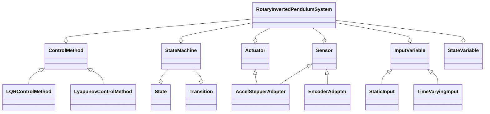

```mermaid
classDiagram
    ControlMethod <|-- LQRControlMethod
    ControlMethod <|-- LyapunovControlMethod

    InputVariable <|-- StaticInput
    InputVariable <|-- TimeVaryingInput
    
    Actuator <|-- AccelStepperAdapter
    Sensor <|-- AccelStepperAdapter
    Sensor <|-- EncoderAdapter

    StateMachine --o State
    StateMachine --o Transition

    RotaryInvertedPendulumSystem --o ControlMethod
    RotaryInvertedPendulumSystem --o StateMachine
    RotaryInvertedPendulumSystem --o Actuator
    RotaryInvertedPendulumSystem --o Sensor
    RotaryInvertedPendulumSystem --o InputVariable
    RotaryInvertedPendulumSystem --o StateVariable

    
```
