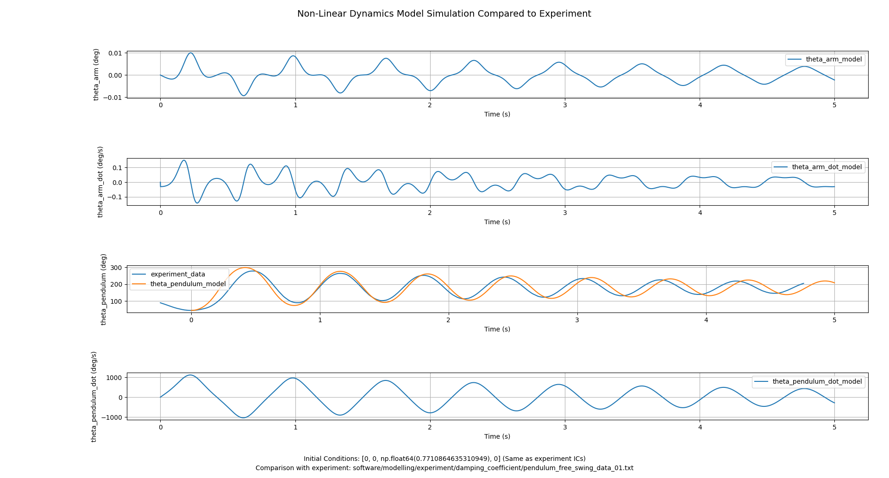

# Rotary Inverted Pendulum Modelling

## Overview

This folder provides the code to model and simulate the rotary inverted pendulum. The code is written in Python and utilizes the `sympy` and `numpy` libraries for symbolic and numerical computations.

## Contents

* `model.py`: This file contains the mathematical model of the rotary inverted pendulum, including the equations of motion and the system parameters.
* `experiment`: This folder contains data from experiments conducted on the rotary inverted pendulum to estimate specific parameters.
    * `damping_coefficient`: This folder contains data and code related to the estimation of the damping coefficient of the pendulum.

## Usage

To use the code in this folder, follow these steps:

1. Install the required libraries by running `pip install -r "software/modelling/requirements.txt"` in your terminal.
2. Run the `model.py` file to view the mathematical model of the pendulum through the terminal, however `simulation.py` will run `model.py` anyways when simulating.
3. Run the `simulation.py` file to simulate linear and non-linear models of the system, depending on what lines you uncomment in the file.

## Example Results

Some examples of simulation plots:

