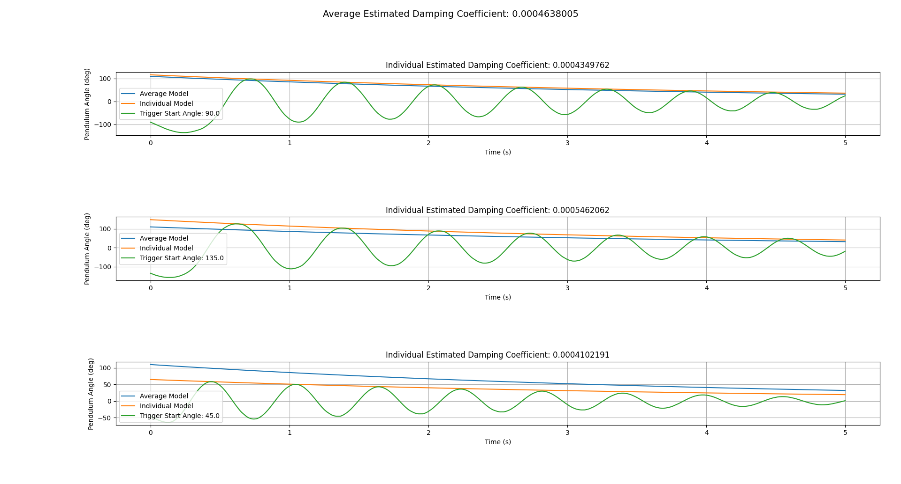

# Damping Coefficient Measurement

## Overview
Estimates the damping coefficient of the pendulum from an experiment letting the pendulum swing freely and recording the angular position of the pendulum over time.

## Contents
- `compute.py`: This file contains the code to calculate the damping coefficient of the pendulum using experimental data.
- `pendulum_free_swing_experiment_data_01.txt`: This file contains angle measurements of the pendulum, in degrees, collected at a sample rate of 1000 samples per second.

## Experiment method
### C++ Arduino Setup
1. If using vscode, open the ```software/control``` directory as a project (i.e File > Open Folder).
1. Select the ```env:angled_record``` environment so that the ```free_swing_angle_record.cpp``` file is compiled instead of the ```lqr_control.cpp``` file.
2. Make sure the pendulum is left swinging down freely without moving and then compile and upload the program to the arduino.
3. Open the serial monitor.

### Procedure
1. Move the pendulum to approximately 90 degrees. As soon as you believe you have reached 90 degrees, let go of the pendulum.
2. The control program will automatically start recording the angle of the pendulum as it swings and print out into the serial monitor.
3. Once the serial monitors outputs 'Done', the recording has finished.
4. Copy the content of the serial monitor and store it inside a file. In this case, the file is called ```pendulum_free_swing_experiment_data_01.txt```.

## Example Results


